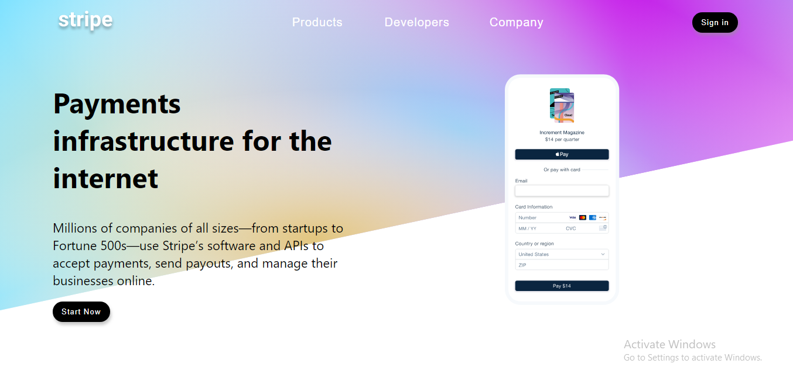
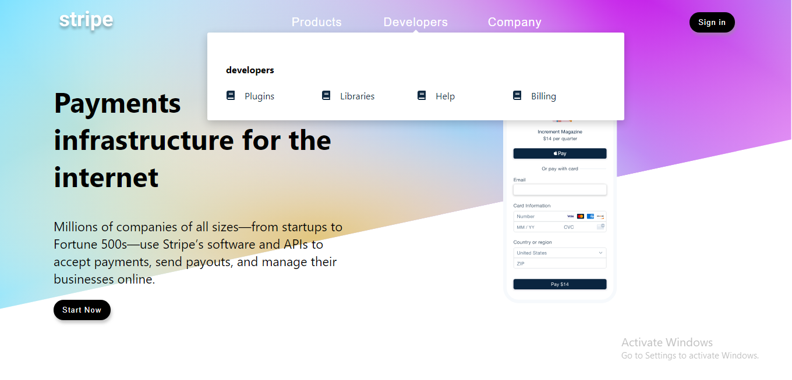
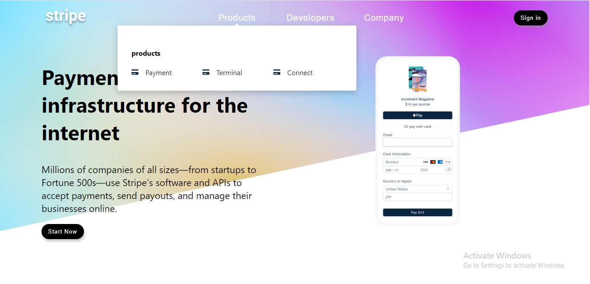
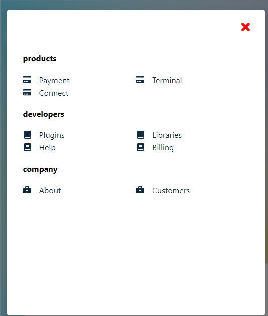

# Stripe-SinglePage
Built A replica of a stripe Home page

Completing one of the most daunting project in my react library learning process, 
built a relica of strip web page, I was able to extend my understanding of making use 
of useContext, useRef and useEffect and other react hooks. The figure below shows
the replica design page of stripe using react and vanilla css, in desktop and mobile 
view. 

# Desktop View 

# Mobile View 

